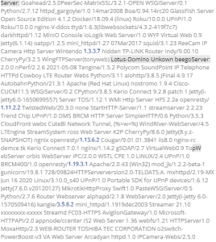
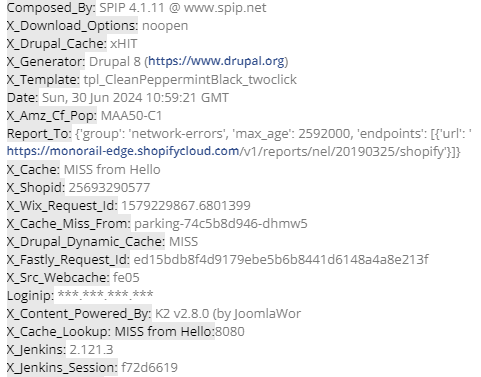
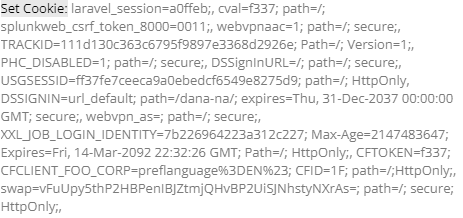
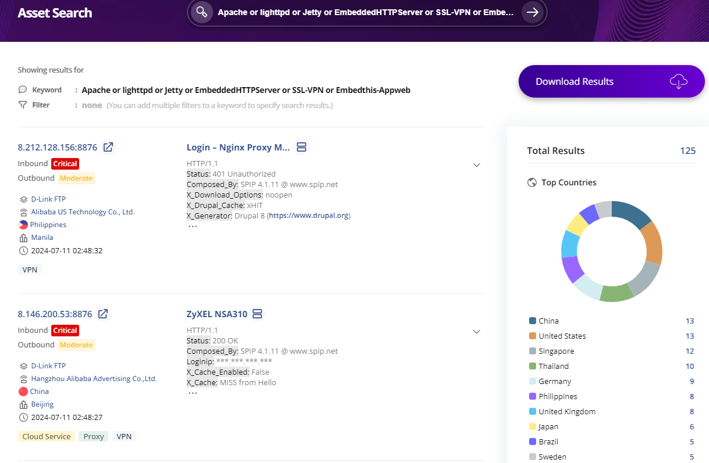

### In search for honeypot :honey_pot::bear:
This is a query that will check the info of a honeypot using **Criminal IP** :honeybee:

### Description :bangbang:
A program that finds honeypot related assets using criminal ip *Asset Search* query

### Prerequisites :round_pushpin:
:heavy_check_mark: Honeypot search query 
:heavy_check_mark: The honeypot information can be retrieved not only with the given query but also by using various server and software keywords. 
:heavy_check_mark: Criminal IP Search query = Apache or lighttpd or Jetty or EmbeddedHTTPServer or SSL-VPN

### Tips for finding honeypots :round_pushpin:
There are several indications in the header and response content suggesting that a server might be a honeypot.  
A *honeypot*:honey_pot: is essentially a simulated system or service created to attract attackers, made to analyze their methods without risking real systems. 
Here are some details from the response that tells us it might be a honeypot.

:one: Variety of Server Software
The response headers list a very diverse array of server software (Server header). 
For example, it includes Apache, nginx, lighttpd, Jetty, Python, Java, etc. 
Typically, a real server uses a specific software stack, but a honeypot may leave various traces to attract attackers.

:two: Strange Version Numbers and Names
The Server header contains specific version numbers along with a wide variety of names. 
This suggests that the honeypot might be including multiple versions and names to make it difficult for attackers to identify specific vulnerabilities.

:three: X-Headers
Many X-Headers are included, such as X-Cache, X-Cache-Lookup, X-Download-Options, X-Permitted-Cross-Domain-Policies, X-Drupal-Dynamic-Cache, X-Generator, X-Jenkins-Session, X-Squid-Error, and more. 
These headers are often used for monitoring or tracking traffic and are a common feature of honeypot systems.

:four: Set-Cookie Header
Numerous cookies are being set, some with outdated dates or strange names. 
This may be for the purpose of tracking sessions or recording the activities of attackers. 
While this is a common authentication failure message, it is often used by honeypots to record attempted access by attackers.

:five: Response Code and Message
The 401 Unauthorized status code indicates that access is not permitted. 
While this is a common authentication failure message, it is often used by honeypots to record attempted access by attackers.

These elements collectively suggest that the response likely comes from a system set up as a honeypot. 
Honeypots are intentionally designed to analyze various attack vectors and study attack patterns, making attackers believe they are interacting with a real system.

### Screens :link:

### Additional Info :triangular_flag_on_post:
When it comes to honeypots, things like favicons can change even if they use the same IP and port. 
This changing appearance is a way to show honeypots in different ways, so attackers have a tough time telling them apart from real systems. 
These visual changes can throw attackers off, making it harder for them to figure out exactly what system or software they're dealing with, 
which makes finding specific weaknesses trickier for them.
